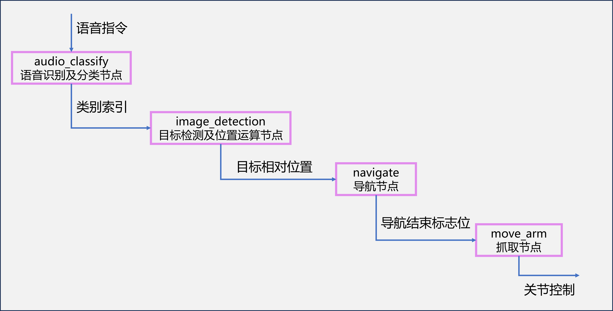

- author: legendleo
# Project Content
- Technical Framework: ROS2 humble + GAZEBO environment
YOLOv8: https://github.com/ultralytics/ultralytics

- Work:
1. Branch base: Basic tasks, complete voice command recognition + visual target detection + SLAM + navigation planning + simple grasping; (Node structure diagram below)

2. Branch master: Multi-tasking, on the basis of basic tasks, can perform sequential tasks - go to multiple locations in sequence to perform grasping of different targets, added angle calibration, increased scene waypoints. (Node structure diagram below)

- Robot Structure:

# Project Effects
- Basic Task Effects

- Multi-Task Effects

# Project File Overview
Go to the mybot_description folder to view
- config: Configuration files generated by the moveit assistant for the robotic arm, used in conjunction with moveit to control the robotic arm;
- launch: Launch files
    - display_rviz2.launch: Start rviz2;
    - gazebo.launch: Start gazebo, load map and robot, load joint states and their control;
    - move_arm.launch: Start moveit;
    - my_moveit_rviz.launch: Start moveit and rviz;
- meshes: Store structural design;
- mybot_description: Node files
    - audio_classify: Language node, microphone input to text, then input to the large model for classification, output to the target detection node;
    - image_detection: Target detection node, input RGB/depth camera module images to YOLO8 for recognition, get target position and distance, output data for specified category targets;
    - move_arm: Node to control the robotic arm to grasp objects;
    - move_claw: Node for debugging grasping actions only;
    - moveit_move_arm: Node to control the robotic arm using moveit's motion group planning;
    - rotate_wheel: Node to control the movement of the cart's wheels;
    - navigate: Given a target point and final direction, the robot navigates to the destination and turns to that direction;
- urdf: Store robot design
    - my_car: Cart without a robotic arm, used for SLAM mapping;
    - six_arm: Six-axis robotic arm mobile robot;
- weights: Store YOLOv8 model weights;
- world: Store maps.