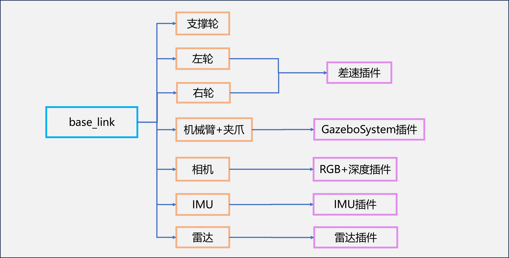

- author：legendleo
# 项目内容
- 技术框架：ROS2 humble + GAZEBO环境
YOLOv8：https://github.com/ultralytics/ultralytics

- 工作：
1. 分支 base：基础任务，完成语音指令识别+视觉目标检测+SLAM+导航规划+简单抓取；（如下图节点结构）

2. 分支 master：多任务，在基础任务的基础上可以执行序列任务——依次到多地点执行不同目标的抓取，添加了角度校准，增加场景航点。（如下图节点结构）

- 机器人结构：

# 项目效果
- 基础任务效果

- 多任务效果

# 项目文件概览
进入mybot_desription文件夹下查看
- config：机械臂使用moveit助手生成的配置文件，用于配合moveit对机械臂进行控制；
- launch：启动文件
    - display_rviz2.launch：启动rviz2；
    - gazebo.launch：启动gazebo，加载地图和机器人，加载关节状态及其控制；
    - move_arm.launch：启动moveit；
    - my_moveit_rviz.launch：启动moveit和rviz；
- meshes：存放结构设计；
- mybot_description：节点文件
    - audio_classify：语言节点，麦克风输入转文字，再输入大模型转为分类，输出给目标检测节点；
    - image_detection：目标检测节点，将RGB/深度相机模组的图像输入YOLO8进行识别，得到目标位置及距离，输出指定类别目标的数据；
    - move_arm：控制机械臂进行夹取物体的节点；
    - move_claw：仅调试夹取动作的节点；
    - moveit_move_arm：使用moveit的动作组规划控制机械臂的节点；
    - rotate_wheel：控制小车车轮运动的节点；
    - navigate：给定目标点和最终方向，机器人导航到目的地并转到该方向；
- urdf：存放机器人设计
    - my_car：没有机械臂的小车，用于SLAM建图；
    - six_arm：六轴机械臂的可移动的机器人；
- weights：存放YOLOv8模型权重；
- world：存放地图。